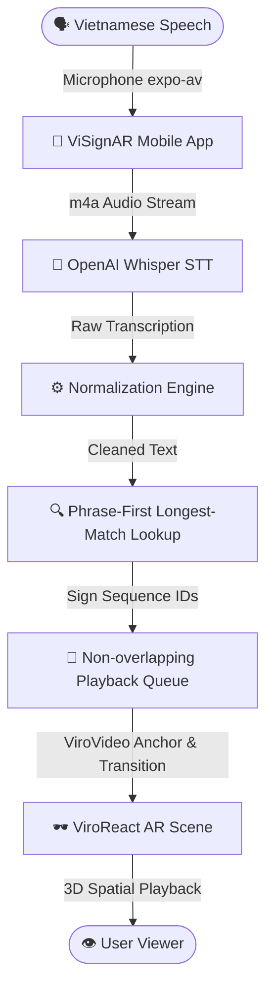

# ✨ ViSignAR ✨

> **Vietnamese Speech-to-Sign Language (VSL) Translator in Augmented Reality (AR) on Mobile Devices**  
> *A lightweight, state-of-the-art mobile application designed to bridge the communication gap between the hearing community and the deaf/hard-of-hearing community in Vietnam.*

---

## 🌟 Overview

**ViSignAR** is an innovative, high-performance mobile application that converts real-time Vietnamese speech into **Vietnamese Sign Language (VSL) animated sign sequences** rendered inside a 3D Augmented Reality (AR) environment. 

By leveraging native AR frameworks (**Apple ARKit** on iOS and **Google ARCore** on Android) via **ViroReact**, the application anchors sign clips in front of the user, preserving spatial context without the overhead of heavy and complex 3D avatar rendering pipelines like Unity.

### 🎯 Key Highlights & Architecture



- **Live Speech-to-Text**: Captures high-fidelity Vietnamese audio locally and streams it securely to **OpenAI Whisper STT (`whisper-1`)** using context prompts for accurate diacritics and spelling.
- **Sound Hallucination Filtering**: Integrates auto-stop thresholds and Whisper's silence evaluation (`no_speech_prob`) to suppress random background noise or silence translations.
- **Deterministic Translation Engine**: Uses a **Phrase-First Longest-Match Lookup** algorithm to resolve words/phrases into sequence IDs, ensuring complex combinations (e.g., `"tạm biệt hẹn gặp lại"`) are translated seamlessly instead of mechanical token-by-token fragmenting.
- **ViroReact-Powered AR Rendering**: Anchors beautiful pre-rendered VSL videos precisely in the user's camera view. Fallbacks gracefully to 2D flat surfaces for devices lacking ARKit/ARCore support.
- **Minimalist Aesthetic Design**: A premium dark theme using a strict three-color palette (`#000000`, `#FFFFFF`, `#013392`) designed to prevent visual clutter and maximize readability for sign language viewers.
- **Unsigned iOS Cloud Build Pipeline**: A custom cloud build script running on EAS (Expo Application Services) that compiles and packages a **fully-functional Unsigned iOS IPA file** entirely in the cloud, completely bypassing the expensive Apple Developer program ($99/year) fee for testing.

---

## 🛠️ Technology Stack

| Layer | Technologies & Libraries |
| :--- | :--- |
| **Mobile Core & UI** | **Expo SDK 54** + **React Native 0.81** (TypeScript), bare workflow after `expo prebuild` |
| **Navigation** | `expo-router v6` (File-based routing) |
| **Audio Capture** | `expo-av` (Highly-responsive mic handler) |
| **Transcription AI** | **OpenAI Whisper STT** (`whisper-1` with `language: vi`) |
| **Augmented Reality** | **ViroReact** (`@reactvision/react-viro` v2.55) |
| **Build & Distribution** | **Expo Application Services (EAS) CLI** + custom cloud scripts |
| **Verification & Quality** | TypeScript (`tsc`), `expo-doctor` |

---

## 📂 Repository Directory Map

The workspace is organized into a clean, modern monorepo-style structure:

```
├── ViSignAR/                     # 📱 Mobile Application Project
│   ├── .eas/                     # Custom EAS Cloud configuration scripts
│   │   └── build/
│   │       └── ios-unsigned.yml  # Unsigned Xcode compilation workflow
│   ├── app/                      # Expo Router screens (Home, Speech-to-Sign, Settings)
│   ├── assets/                   # High-quality sign reference clips and dictionary definitions
│   │   ├── dictionary/
│   │   │   └── v1.json           # 29 core VSL dictionary entries
│   │   └── signs/                # Canonical 1200ms VSL reference video clips (mp4)
│   ├── src/                      # TypeScript Application Code
│   │   ├── components/           # Reusable UI controls (StatusBadge, TranscriptView, ARScene)
│   │   ├── constants/            # Themes, Sign Assets mapping
│   │   ├── hooks/                # Settings and stores hooks
│   │   ├── services/             # Core pipelines (Normalize, STT, Lookup, Playback Queue, Logger)
│   │   └── store/                # Shared settings store
│   ├── android/                  # Native Android shell (from expo prebuild)
│   ├── app.json                  # Expo config file
│   ├── eas.json                  # EAS Build targets (Android APK & iOS unsigned profiles)
│   ├── package.json              # Dependecy declarations & run scripts
│   └── tsconfig.json             # TypeScript configuration
├── SRS_ViSignAR.md               # 📝 Full Software Requirements Specification (SRS)
└── Thesis_Outline_ViSignAR.md    # 🎓 Detailed Thesis Outline & Technical Contribution (Vietnamese)
```

---

## 🚀 Setup & Installation Guide

Follow these simple steps to set up the environment and run the application locally on your computer or physical devices.

### 📋 Prerequisites

Ensure you have the following installed on your machine:
- **Node.js** (v18.x or v20.x recommended) & **npm**
- **Expo Go** app or an **Expo Dev Client** on your physical mobile device.
- **For Android Emulation**: [Android Studio](https://developer.android.com/studio) with SDK platform tools and a running Virtual Device (AVD).
- **For iOS Emulation (Mac-only)**: [Xcode](https://developer.apple.com/xcode/) with command-line tools.

---

### 1. Clone & Project Navigation
Clone the repository and enter the mobile application directory:
```bash
git clone https://github.com/Lehoangminh-dab/int3121-1-uet-2026-cac-chuyen-de-trong-khmt-final-semester-btl.git
cd int3121-1-uet-2026-cac-chuyen-de-trong-khmt-final-semester-btl/ViSignAR
```

### 2. Dependency Installation
Install all React Native, Expo, and ViroReact dependencies:
```bash
npm install
```

### 3. Environment Variable Setup
The project utilizes the OpenAI Whisper API for transcription. Follow these steps to configure your API key safely:
1. Create a copy of the example environment file:
   ```bash
   cp .env.example .env
   ```
2. Open the newly created `.env` file and input your OpenAI API key:
   ```env
   EXPO_PUBLIC_OPENAI_KEY=sk-proj-YourActualOpenAiApiKeyHere...
   ```

> [!WARNING]
> Never commit your `.env` file or expose your API keys in a public repository. The `.env` file is pre-configured in `.gitignore`.

---

## 💻 Running the Application

### Local Development Server
Start the interactive Expo developer console:
```bash
npm start
```

### Running on Emulators
Ensure your emulator is open and running in the background, then trigger:
* **Android Emulator**:
  ```bash
  npm run android
  ```
* **iOS Simulator (Mac Only)**:
  ```bash
  npm run ios
  ```

---

## 🛡️ Verification & Quality Checks

Run these validation commands before committing to maintain codebase health and compliance with the specification:

```bash
# Verify type safety across all TypeScript components (Zero Errors allowed)
npx tsc --noEmit

# Run Expo's dependency and configuration health diagnostics (17/17 checks)
npx expo-doctor

# Build bundles locally to ensure no bundle-time reference issues
npx expo export --platform android
```

---

## 📦 Production Builds & Cloud Packaging (EAS)

Deployments and builds are handled elegantly using **Expo Application Services (EAS)** on Expo's high-speed cloud infrastructure.

### Preparation
1. Install the global EAS Command Line Interface:
   ```bash
   npm install -g eas-cli
   ```
2. Log in or create an account with Expo:
   ```bash
   npx eas login
   ```

### 🤖 Android Release (Pre-packaged APK)
Build an installable `.apk` file instantly using the pre-configured preview profile:
```bash
npx eas build --platform android --profile preview
```

### 🍏 Cloud Unsigned iOS IPA Build (Developer Bypass)
> [!IMPORTANT]
> One of the highlight technical contributions of this project is the **Cloud Unsigned iOS Compilation Pipeline**.
> By executing a cloud build on macOS systems using a customized Xcode command without signing parameters, developers can build a testable `.ipa` file without buying a $99 Apple Developer subscription!

Build an unsigned iOS app bundle in the cloud using:
```bash
npx eas build --platform ios --profile ios-unsigned
```
*The resulting unsigned `.ipa` artifact can be easily sideloaded onto jailbroken or developer-configured devices using utility apps like AltStore or Sideloadly.*

---

## 👥 Roles & Project Contributors

As specified in the development plans, the project successfully split task allocations into three critical tracks:
- **A — Tech Lead**: Architecture design, ViroReact AR platform integrations, EAS pipeline configurations.
- **B — Content Engineer**: 23 VSL high-fidelity reference video acquisitions, FFMPEG post-processing constraints (1200ms duration, 30fps), asset registry declarations.
- **C — Integration Engineer**: `ViroVideo` lifecycle management, playback sequence bridge worker wiring, physical ARCore/ARKit end-to-end device trials.

---

## 📄 References & Resources
- **ViroReact AR Documentation**: [https://viro-community.readme.io/](https://viro-community.readme.io/)
- **OpenAI Speech-To-Text**: [https://platform.openai.com/docs/guides/speech-to-text](https://platform.openai.com/docs/guides/speech-to-text)
- **Official VSL Dictionary**: [https://tudienngonngukyhieu.com/](https://tudienngonngukyhieu.com/)
- **Project Requirements**: Refer to the detailed specifications in [SRS_ViSignAR.md](file:///d:/Code/int3121-1-uet-2026-cac-chuyen-de-trong-khmt-final-semester-btl/SRS_ViSignAR.md)

---

> [!NOTE]
> For any detailed structural implementation questions or theoretical thesis arguments, please read the [Thesis_Outline_ViSignAR.md](file:///d:/Code/int3121-1-uet-2026-cac-chuyen-de-trong-khmt-final-semester-btl/Thesis_Outline_ViSignAR.md) document (in Vietnamese) and [SRS_ViSignAR.md](file:///d:/Code/int3121-1-uet-2026-cac-chuyen-de-trong-khmt-final-semester-btl/SRS_ViSignAR.md).
